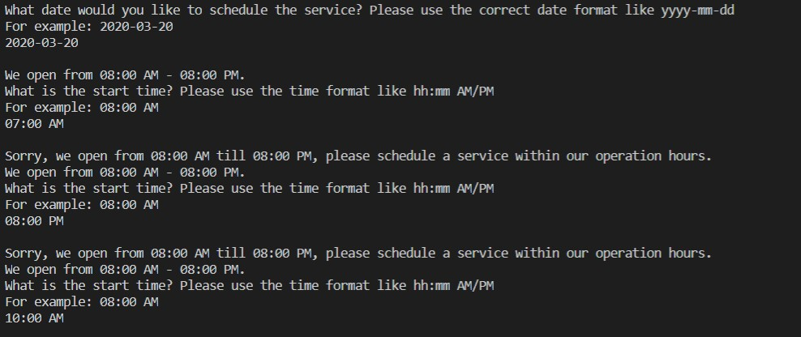

# Mud In Your Eye SPA Reservation CML Application: Team 3 (Braden Tabisula, Donald Berry, Wei Sui)

## Objective: CML Application for Scheduling, availabile timeslot checking, appointment modification, system maintenance by manager
1. Mud in your eye operation hours: 08:00 AM - 08:00 PM
2. Services offered: 
  - Facial: normal facial & collagen facial
  - Massage: sedish massage & shiatsu massage & deep tissue
  - Mineral Bath
  - Sepcialty Treatment: hot stone & sugar scrub & herbal body wrap & botanical mud wrap
3. Login system: 
  - all front desk staffs have one password to access to the main menu: services scheduling and availability checking, appointment modification
  - Manager has access to the system maintenance menu: price, service, time adjustment
## Implementation: 
 - Python: Pandas, datetime, getpass, enum
 - Database: SQLite
 - Testing: Unit test with print out certain instances, system test with running the application directly (follow a user's case to run the application) 
### Main menu display:

 
#### Application is able to check if the client is in our resort database, and if the service date is within the range of client's stay, example shows below:

#### Application is able to check if appointment time is booked by other clients, and if the time is within the operation hours, example shows below:

#### Application is able to generate a receipt with scheduling details and confirmation number, and it will save as a text file, so staffs are able to print out for client.

#### The end of the day, staffs are able to quit the system. 

### Maintenance Menu displays below, and you are able to modify service, price, and add a new service. 

### Add a New Service:
#### Entering option 2 from the Maintenance Menu will bring you to the Add a New Service function
  - You will need to confirm that this is what you want to do
  - You will be asked to enter the following data for the New Service: (Name, Rate, Duration, Type of Service)

### Search for a Service:
#### Entering option 1 from the Maintenance Menu will bring you to the Search for a Service function
  - You will need to confirm that this is what you want to do
  - You will be asked to either search by Name or Type

### Maintenance system also includes updating a current service and search a service with its detailed information; when the user enters 6, Maintenance Menu will log you out and bring you back to the Scheduling Menu; when the user enter 7, it will quit the program